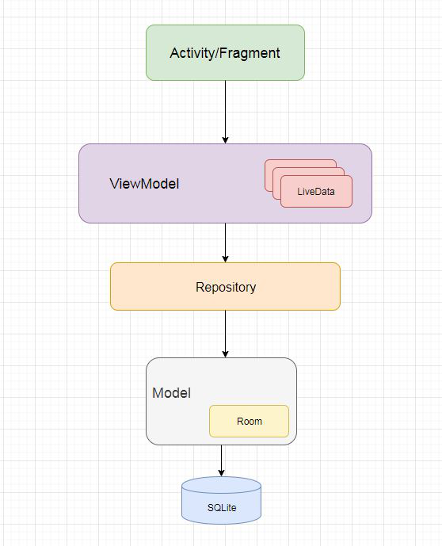
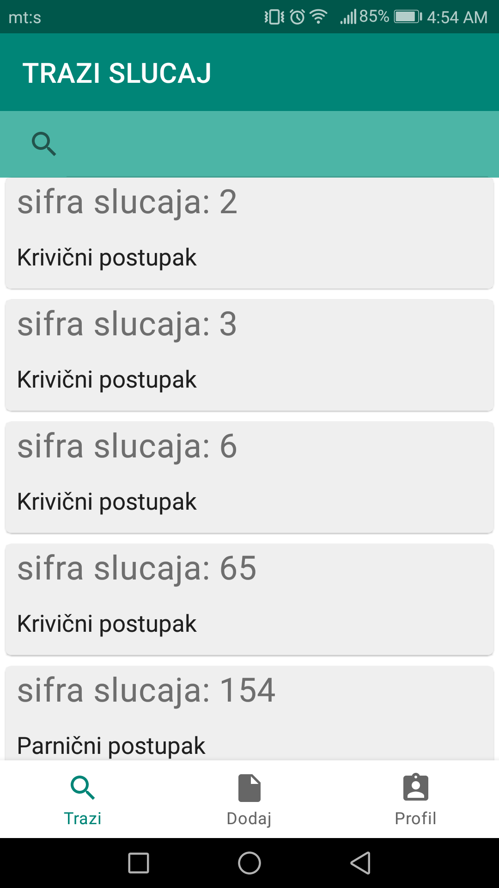
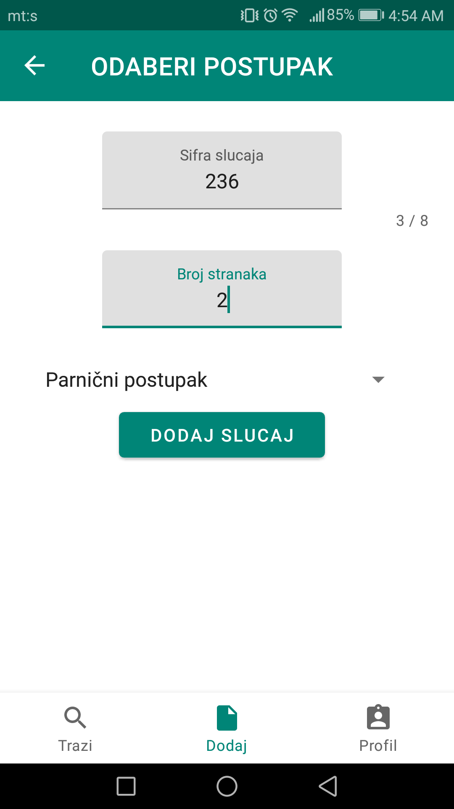
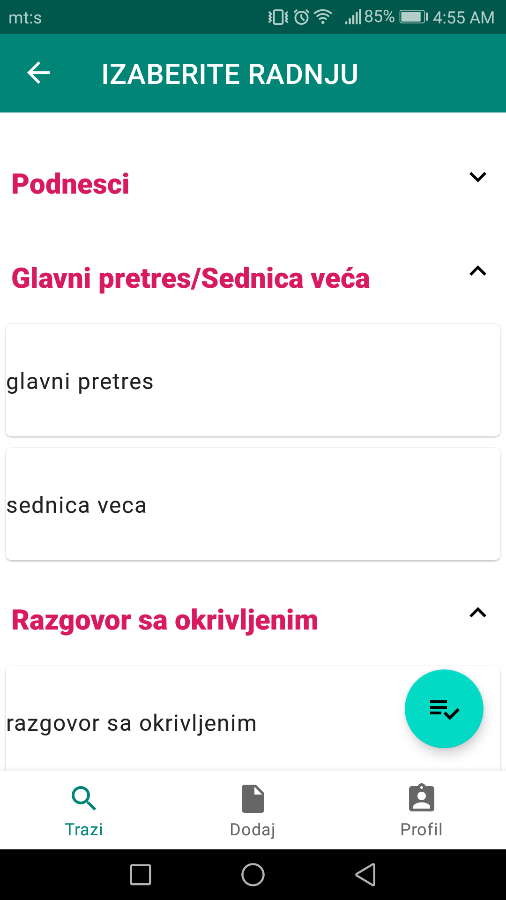
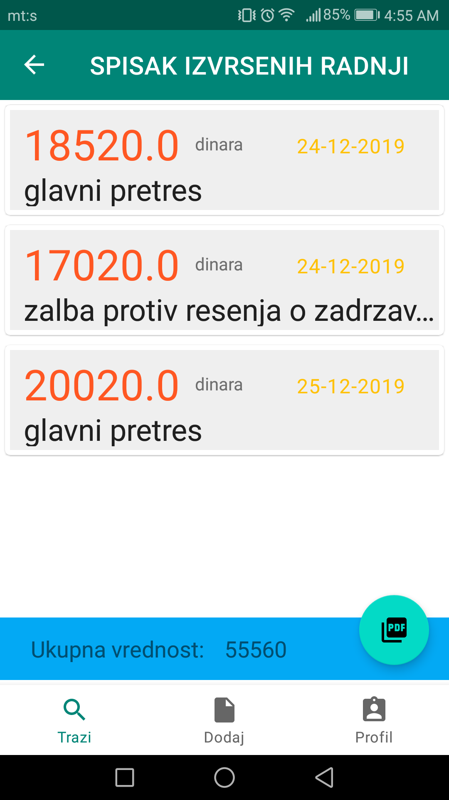
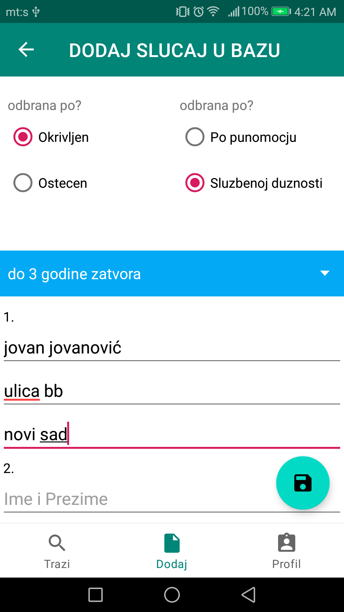
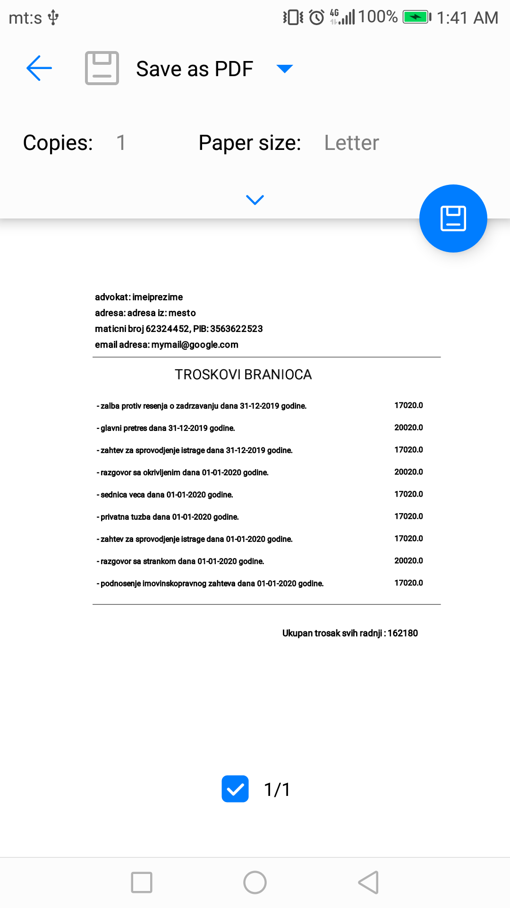

# Advokatska Tarifa Kalkulator

Pozdrav! **Advokatska Tarifa Kalkulator** je mobilna Android aplikacija za brzo računanje nagrada i naknada za troškove rada advokata u republici Srbiji [(radnjena u skladu pravilnika o tarifama)](https://www.paragraf.rs/propisi/tarifa_o_nagradama_i_naknadama_troskova_za_rad_advokata.html) . Pored računanja, aplikacija podržava i čuvanje svih započetih slučajeva, unos odrađenih radnji i njihovu evidanciju na memoriji telefona. Na kraju postoji opcija da konačni trošak sačuvate u vidu pdf dokumeta ili da ga direktno štampate preko WiFi štampača.

# Razvojno Okruzenje

 Aplikacija je u potpunosti pisana u programskom jeziku **Kotlin**.

## Dizajn Patern

Dizajn Patern za korišćen za izradu aplikacije je bio MVVM uz standardno dodavanje jos jednog sloja (Repository). Takodje, koriscen je i Single Activity princip arhiktekture.

## Screenshots

 

## Korišćenje Biblioteke

[Arhitecture](https://developer.android.com/topic/libraries/architecture)
 -  [Data Binding](https://developer.android.com/topic/libraries/data-binding/)
 - [Lifecycles](https://developer.android.com/topic/libraries/architecture/lifecycle)
 - [LiveData](https://developer.android.com/topic/libraries/architecture/livedata)
 - [Navigation](https://developer.android.com/guide/navigation/)
 - [Room](https://developer.android.com/topic/libraries/architecture/room)
 - [ViewModel](https://developer.android.com/topic/libraries/architecture/viewmodel)

[UI](https://developer.android.com/guide/topics/ui)

 - [Fragment](https://developer.android.com/guide/components/fragments)
 - [Layout](https://developer.android.com/guide/topics/ui/declaring-layout)

Third party

 - [Timber](https://github.com/JakeWharton/timber)
 - [Grupie](https://github.com/lisawray/groupie)
 - [Material Dialogs](https://github.com/afollestad/material-dialogs)
 - [Kotlin Coroutines](https://kotlinlang.org/docs/reference/coroutines-overview.html)

Dependency Injection

 - [Kodein](https://github.com/Kodein-Framework/Kodein-DI)

## Moguće Nadogradnje 

Kreiranje web aplikacije 

Skladistenje podataka na remote database

##  Zahvalnica

Hvala na doprinosu !
Saradnici: 

 - [Strucni saradnik  -  Milorad Jovic Dipl Pravnik](https://rs.linkedin.com/in/milorad-jovi%C4%87-966479121)

 - [icon](https://www.flaticon.com/free-icon/calculator_1750428?term=lawyer%20calculator&page=1&position=2)
 
# Licence
**No Licence**

